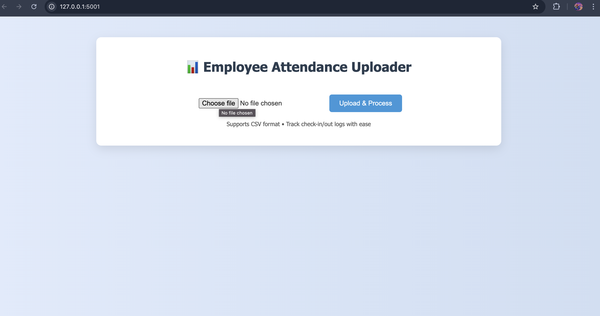
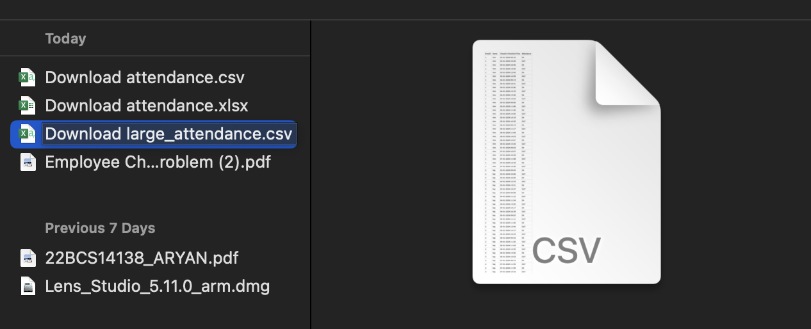
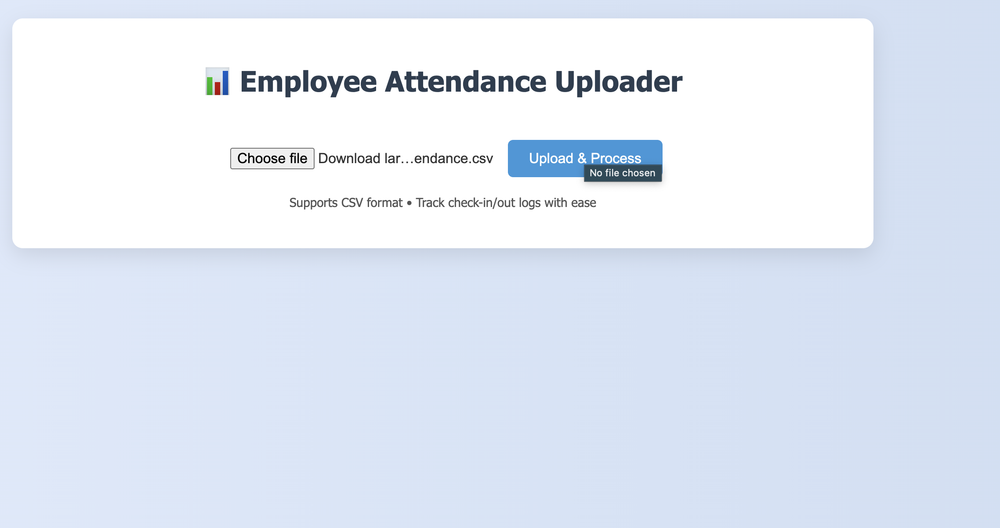
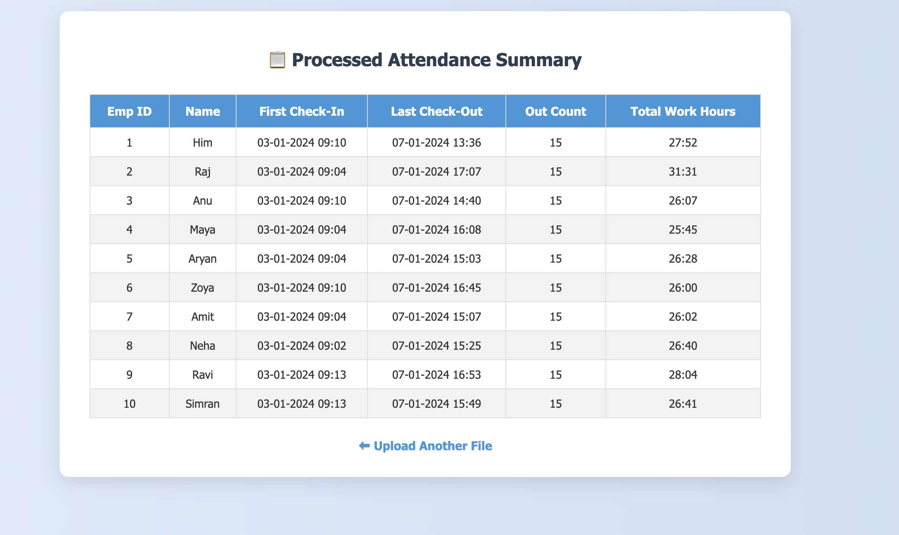

# 🧾 Employee Attendance System (Flask + SQL)

A simple web app built with **Flask** and **MySQL/PostgreSQL** to track employee check-in and check-out times.

---

## 🚀 Features

- Upload CSV attendance files
- Calculates:
  - First Check-In
  - Last Check-Out
  - Total OUT Count
  - Total Work Hours (excluding OUT time)
- Displays results in a clean table
- Frontend with modern HTML/CSS

---

## 🛠 Tech Stack

- Python + Flask
- MySQL / PostgreSQL
- HTML, CSS
- Pandas (for data processing)

---

## 📦 How to Run Locally

```bash
git clone https://github.com/ArYaN14138/EmployeeAttendance.git
cd EmployeeAttendance

# (optional) create a virtual environment
pip install -r requirements.txt

# Make sure your DB is running and schema is created
export FLASK_APP=app.py

flask run --port=5001
```
## 🖼️ Screenshot

> Below is a preview of the frontend:





